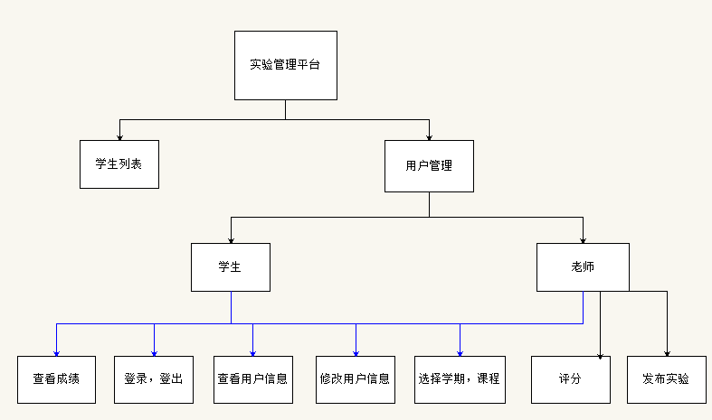
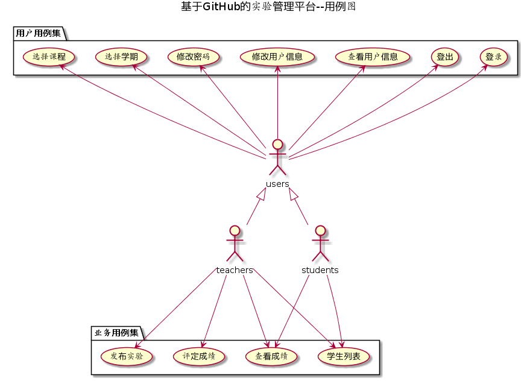
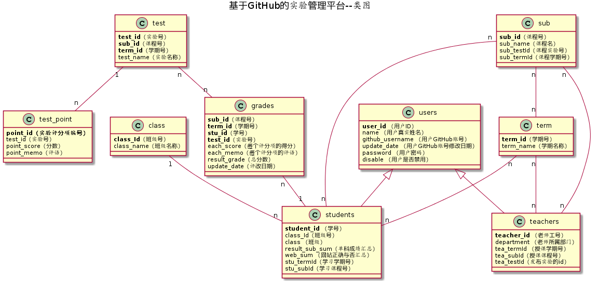

# 基于GitHub的实验管理平台的分析与设计
### 成都大学信息科学与工程学院
|学号|班级|姓名|
|:-:|:-:|:-:|
|201510414311|软件3班|彭启瑞|

## 1. 概述
- 基于GitHub的实验管理平台的作用是在线管理实验成绩的Web应用系统。学生和老师实验内容均存放在GitHUB 页面上。
- 学生的功能主要有：一是设置自己的GitHub用户名，二是查询自己的实验成绩。学生的GitHub用户名是公开的，但成绩不公开。
- 老师和学生都能通过本系统的链接方便地跳转到学生的每个GitHUB实验目录，以便批改实验或者查看实验情况。
- 实验成绩按数字分数计算，每项实验的满分为100分，最低为0分。
- 系统自动计算每个学生的所有实验的平均分。

## 2. 系统总体结构

界面设计参见：https://201510414311.github.io/is_analysis/test6/index.html

## 3. 用例图设计 [源码][1]

## 4. 类图设计 [源码][2]

## 5. 数据库设计
[参见数据库设计][3]

## 6.用例及界面详细设计
- [查看成绩用例][4]
- [查看用户信息用例][5]
- [登出用例][6]
- [登录用例][7]
- [发布实验用例][8]
- [评定成绩用例][9]
- [修改用户信息用例][10]
- [选择课程用例][11]
- [选择学期用例][12]
- [学生列表用例][13]

  [1]: https://github.com/201510414311/is_analysis/blob/master/test6/yuanma/用例图.puml
  [2]: https://github.com/201510414311/is_analysis/blob/master/test6/yuanma/类图.puml
  [3]: https://github.com/201510414311/is_analysis/blob/master/test6/数据库设计.png
  [4]: https://github.com/201510414311/is_analysis/blob/master/test6/%E6%9F%A5%E7%9C%8B%E6%88%90%E7%BB%A9%E7%94%A8%E4%BE%8B.md
  [5]: https://github.com/201510414311/is_analysis/blob/master/test6/%E6%9F%A5%E7%9C%8B%E7%94%A8%E6%88%B7%E4%BF%A1%E6%81%AF%E7%94%A8%E4%BE%8B.md
  [6]: https://github.com/201510414311/is_analysis/blob/master/test6/%E7%99%BB%E5%87%BA%E7%94%A8%E4%BE%8B.md
  [7]: https://github.com/201510414311/is_analysis/blob/master/test6/%E7%99%BB%E5%BD%95%E7%94%A8%E4%BE%8B.md
  [8]: https://github.com/201510414311/is_analysis/blob/master/test6/%E5%8F%91%E5%B8%83%E5%AE%9E%E9%AA%8C%E7%94%A8%E4%BE%8B.md
  [9]: https://github.com/201510414311/is_analysis/blob/master/test6/%E8%AF%84%E5%AE%9A%E6%88%90%E7%BB%A9%E7%94%A8%E4%BE%8B.md
  [10]: https://github.com/201510414311/is_analysis/blob/master/test6/%E4%BF%AE%E6%94%B9%E7%94%A8%E6%88%B7%E4%BF%A1%E6%81%AF%E7%94%A8%E4%BE%8B.md
  [11]: https://github.com/201510414311/is_analysis/blob/master/test6/%E9%80%89%E6%8B%A9%E8%AF%BE%E7%A8%8B%E7%94%A8%E4%BE%8B.md
  [12]: https://github.com/201510414311/is_analysis/blob/master/test6/%E9%80%89%E6%8B%A9%E5%AD%A6%E6%9C%9F%E7%94%A8%E4%BE%8B.md
  [13]: https://github.com/201510414311/is_analysis/blob/master/test6/%E5%AD%A6%E7%94%9F%E5%88%97%E8%A1%A8%E7%94%A8%E4%BE%8B.md