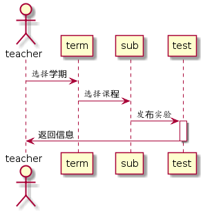

# 发布实验用例 [返回](./README.md)
## 1. 用例规约
|用例名称|发布实验|
|:-:|:-:|
|功能|老师发布新的实验|
|参与者|老师|
|前置条件|老师需要先登录|
|后置条件||
|主事件流||
|备选事件流||
## 2. 业务流程 [源码](./yuanma/发布实验.puml)

## 3. 界面设计

 - 界面参照：https://201510414311.github.io/is_analysis/test6/teachertest.html
 - API接口调用
    - 接口一：[setTest](./setTest.md)（发布实验）
    - 接口二：[getTest](./getTest.md) (显示实验）
    
## 4. 算法描述

## 5. 参照表
- TEACHERS
- TEST
- TERM

