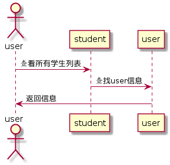

# 学生列表用例 [返回](./REDEME.md)
## 1. 用例规约
|用例名称|学生列表|
|:-:|:-:|
|功能|查看学生列表信息|
|参与者|学生/老师/游客|
|前置条件|学生，老师需要先登录|
|后置条件||
|主事件流||
|备选事件流||
## 2. 业务流程

## 3. 界面设计

 - 界面参照：https://201510414311.github.io/is_analysis/test6/index.html
 - API接口调用
    - 接口一：[getStudentList][1]
## 4. 算法描述
- WEB_SUM解析为列表
    - WEB_SUM是接口getStudents的返回值中的一部分，形如："WEB_SUM": "Y,Y,Y,Y,Y,N"。需要在前端进行解析。
    - 作用是判断GitHub网址是否正确，用逗号分开，Y代表正确，N代表不正确。
    - 第1位代表总的GitHUB地址是否正确，第2位表示第1次实验的地址，第3位表示第2位实验地址，依此类推。
    - 比如：“Y,Y,Y,Y,Y,N”表示第5次实验地址不正确，其他地址正确。
    - 算法是使用使用字符串分离方法将其分开。

## 5. 参照表
- USERS
- CLASS
- STUDENTS

  [1]: https://201510414311.github.io/is_analysis/test6/getStudentList.md