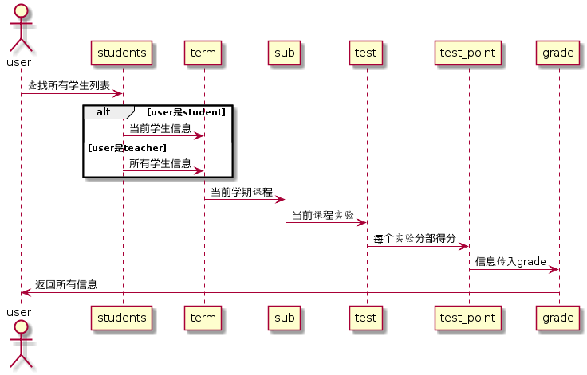

# 查看成绩用例 [返回](https://github.com/201510414311/is_analysis/blob/master/test6/README.md)
## 1. 用例规约
|用例名称|查看成绩|
|:-:|:-:|
|功能|查看学生的成绩，老师查看所有，学生查看自己|
|参与者|学生/老师|
|前置条件|学生，老师需要先登录|
|后置条件||
|主事件流||
|备选事件流||
## 2. 业务流程 [源码](./yuanma/查询成绩.puml)

## 3. 界面设计

 - 界面参照：https://201510414311.github.io/is_analysis/test6/stulookscore.html
 - API接口调用
    - 接口一：[getStudentGrade][1]（学生自己）
    - 接口二：[getStudentGradeList][2]（教师查看成绩）
## 4. 算法描述
- RESULT_SUB_SUM解析为列表解析为列表
    - RESULT_SUB_SUM是接口getStudents的返回值中的一部分，形如："RESULT_SUB_SUM": "81.25,70,80,85,90,N"。需要在前端进行解析。
    - 成绩汇总（来自GRADES表），以逗号分开，第一个成绩是平均成绩,后面是每次实验的成绩，N表示未批改，平均分只计算已批改的。。
    - 比如：“81.25,70,80,85,90,N”表示一共批改了4次，第5次未批改，4次的成绩分别是81.25,70,80,85,90,N，4次的平均分是81.25。
    - 算法是使用使用字符串分离方法将其分开。

## 5. 参照表
- USERS
- SUB
- TEST
- GRADES
- CLASS
- STUDENTS

  [1]: https://github.com/201510414311/is_analysis/blob/master/test6/getStudentList.md
  [2]: https://github.com/201510414311/is_analysis/blob/master/test6/getStudentGradeList.md
