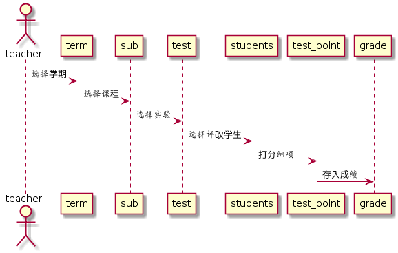

# 评定成绩用例 [返回](./REDEME.md)
## 1. 用例规约
|用例名称|评定成绩|
|:-:|:-:|
|功能|老师评价学生实验成绩|
|参与者|老师|
|前置条件|学生，老师需要先登录|
|后置条件||
|主事件流||
|备选事件流||
## 2. 业务流程

## 3. 界面设计

 - 界面参照：https://201510414311.github.io/is_analysis/test6/teacherlookstu2.html
 - API接口调用
    - 接口一：[getSubGradeStudent][1]（用于显示课程的学生成绩信息）
    - 接口二：[setOneStudentResults][2]（用于设置一个学生的部分实验成绩和评语）
## 4. 算法描述

## 5. 参照表
- SUB
- TEACHERS
- TEST
- TERM
- TEST_POINT
- GRADES
- STUDENTS

  [1]: https://201510414311.github.io/is_analysis/test6/getSubGradeStudent.md
  [2]: https://201510414311.github.io/is_analysis/test6/setOneStudentResults.md