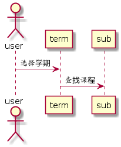

# 选择学期用例 [返回](./README.md)
## 1. 用例规约
|用例名称|选择学期|
|:-:|:-:|
|功能|选择自己的学期|
|参与者|学生/老师|
|前置条件|已经登录的用户|
|后置条件||
|主事件流||
|备选事件流||
## 2. 业务流程 [源码](./yuanma/选择学期.puml)

## 3. 界面设计

 - 界面参照：https://201510414311.github.io/is_analysis/test6/stuxuanke.html
 - API接口调用
    - 接口一：[getUserTerm](./getUserTerm.md)
## 4. 算法描述
无
## 5. 参照表
- TERM
- STUDENTS
- TEACHERS
